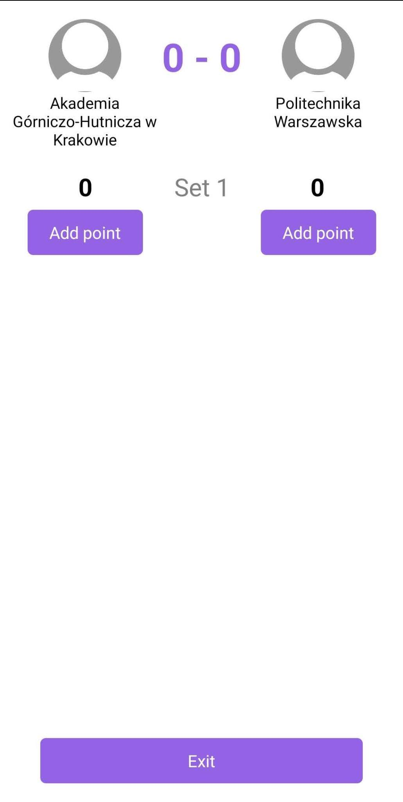

# Praca inżynierska - aplikacja mobina dla sędziów

Aplikacja mobilna jest jedną z części pracy inżynierskiej i została napisana z wykorzystaniem ReactNative.

# Wygnąd programu
### Ekran logowania

### Ekran logowania do meczu

### Ekran zarządzania meczem
